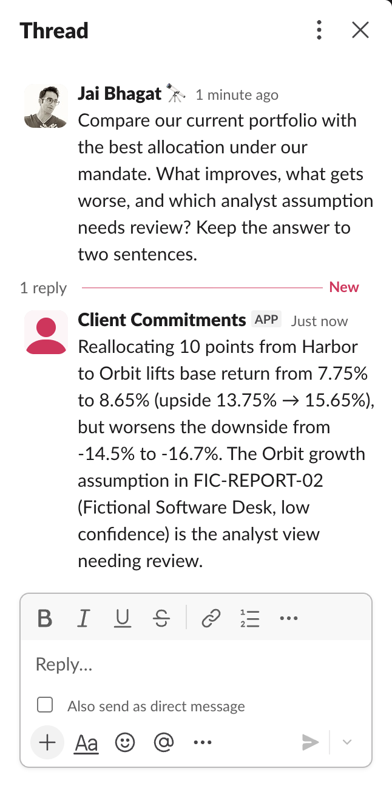

# Portfolio allocation review

Compare a proposed allocation against the portfolio mandate, inspect the assumptions and save a candidate for a named reviewer. The conversation explains both the expected return and the downside.

## How it works

Python calculates scenario returns and checks allocation constraints. Hermes uses local Bonsai to select tools and explain their results, then saves the requested candidate as a local review draft. See the [architecture](docs/architecture.md) for data flow, persistence and failure handling.

The [recorded Slack review](docs/google-verification.md) compared the candidate and saved a draft for Anthony.



## Get started

The example uses sample holdings, prices and analyst assumptions. Python 3.10 or newer runs the sample calculation. Expect 20 feasible allocations, a base return change from 7.75% to 8.65%, and a downside change from -14.50% to -16.70%. [Setup](docs/setup.md) adds the conversational agent.

```sh
git clone https://github.com/ChaiWithJai/bonsai-hermes-finance-workstation.git
cd bonsai-hermes-finance-workstation
python3 -m venv .venv
source .venv/bin/activate
python -m pip install -e .
python -m finance_workstation example
```

## Resources

| Resource | Use it to |
| --- | --- |
| [Setup](docs/setup.md) | Run the agent and connect its inputs. |
| [Model parameters](docs/parameter-guide.md) | Understand the settings, evidence and tuning tradeoffs. |
| [Configuration capture](docs/recorded-configuration.md) | Inspect the recorded model and Hermes settings. |
| [Slack and Google](docs/integrations.md) | Connect Slack and import a Sheet snapshot. |
| [Development](docs/development.md) | Find the implementation and run its tests. |
