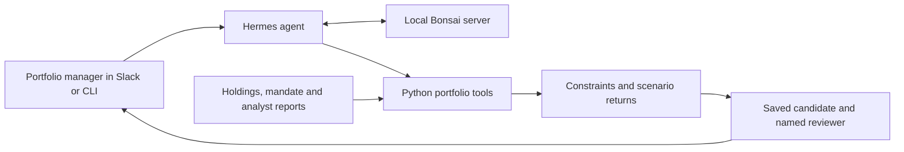
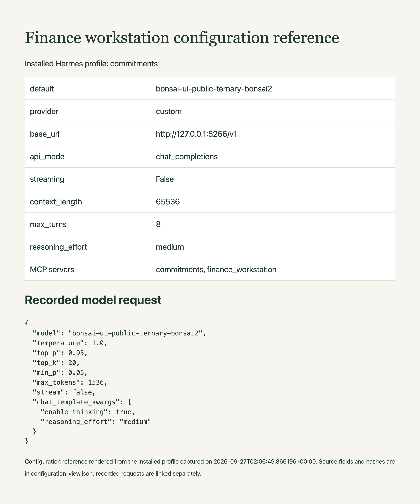

# Compare portfolio allocations before the investment review

Ask how a proposed allocation changes expected returns and downside exposure, then save the candidate with a named reviewer. The agent brings the mandate, scenario calculation and supporting analyst assumptions into one conversation so the portfolio manager can decide which tradeoff deserves further review.

The sample starts with a $1 million portfolio. Moving ten percentage points from Harbor to Orbit raises the assumed base return from 7.75% to 8.65%, while worsening the downside from -14.50% to -16.70%. Orbit's low-confidence growth assumption is the issue the reviewer needs to examine.


## How a comparison becomes a review draft



Python calculates the scenarios and searches feasible allocations under the mandate. Hermes asks the local Bonsai model which tools to call and how to explain the results. When the manager requests a draft, the tool verifies the source snapshot, saves the candidate and reviewer, then reads the file back. The draft is a local review record; execution of a trade belongs to the team's trading system.

A spreadsheet already provides a good place to maintain holdings and assumptions. This example adds conversational comparison and a saved decision context without asking the model to do portfolio arithmetic. A fixed report is simpler for a fixed question; the agent is useful when the manager wants to change a constraint, question an assumption or follow up on a candidate. The [architecture walkthrough](docs/architecture.md) explains where those responsibilities live.

## Run the calculation

With Python 3.10 or newer:

```sh
git clone https://github.com/ChaiWithJai/bonsai-hermes-finance-workstation.git
cd bonsai-hermes-finance-workstation
python3 -m venv .venv
source .venv/bin/activate
python -m pip install -e .
python -m finance_workstation example
```

Expected results:

```text
Feasible allocations: 20
Candidate weights: FCT-HARBOR 35%, FCT-ORBIT 45%, FCT-RESERVE 20%
Base scenario: 7.75% -> 8.65%
Downside scenario: -14.50% -> -16.70%
One-way turnover: 10.0%
```

The example uses sample holdings and analyst assumptions. Its five-percentage-point search grid and scoring rule are defined in [the mandate](src/finance_workstation/sample_data/mandate.json). The result describes those assumptions, rather than a forecast of market performance.

Next, follow [model and harness setup](docs/setup.md) to run the same tools through Hermes. Ask the agent to compare the current portfolio with the best candidate under the mandate, explain the downside and cite the assumption that needs review. Then ask it to save the candidate for Anthony. The [integration guide](docs/integrations.md) adds Slack and a Google Sheets import after the local workflow works.

## Why these model settings

Bonsai supplies the language reasoning and tool selection; the application checks the facts it can verify in code. The reference run uses Ternary Bonsai 2 27B in PQ2_0 format on an M5 Pro with 48 GiB of memory. The model and matching Prism runtime are a reproducible starting point for a workstation deployment.

The [parameter guide](docs/parameter-guide.md) explains temperature, sampling, context, reasoning budget and tool limits, with sources and a task-specific evaluation plan. The settings follow the publisher's thinking-mode guidance. The workflow has been exercised with them, but a controlled comparison has not established an optimal configuration for legal or finance work.



The [configuration record](docs/recorded-configuration.md) identifies the profile and request fields used to produce this reference view.

## Find the code and extend it

| Location | What to change |
| --- | --- |
| `src/finance_workstation/tools.py` | Scenario arithmetic, constraints and draft persistence. |
| `src/finance_workstation/sample_data/` | Holdings, analyst assumptions and the mandate. |
| `src/finance_workstation/sheets.py` | Import of a Google Sheets snapshot. |
| `config/` | Hermes instructions, tool access and Slack manifest. |
| `scripts/` | Model startup, profile setup and result export. |
| `tests/` | Calculation, source and persistence checks. |
| `docs/`, `evidence/` | Architecture, setup, captured sessions and screenshots. |

Run `python -m unittest discover -s tests -v` after changing the calculation or a tool. The [connected verification](docs/google-verification.md) shows the Sheet import and saved Slack draft; the [performance record](docs/performance.md) separates request time and repeated calls so you can identify work worth reducing.
