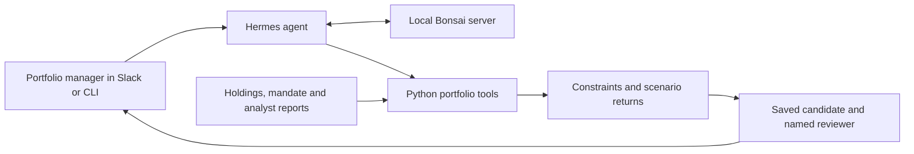

# From allocation question to saved review

The portfolio manager starts in the CLI or Slack. Hermes sends the conversation and available tool schemas to the local Bonsai endpoint, then executes the tool calls selected by the model. The tools read holdings, analyst reports and the written mandate from the configured data directory.

Python computes weighted scenario returns and searches a five-percentage-point allocation grid. It checks the mandate's bounds, turnover and downside floor before returning feasible candidates. The model explains the resulting numbers and cites the assumptions behind them. Changing temperature affects generated language and tool selection; it does not change the return formula.

When asked to save a draft, the tool checks the source snapshot and writes a local JSON record containing the candidate, reviewer and pending-review status. It reads the file back before reporting success. Repeating the same request preserves the draft; requesting a different reviewer for the same draft is rejected instead of silently reassigning it.

## Connections and persistence

| Component | Responsibility |
| --- | --- |
| Google Sheets importer | Downloads holdings and analyst rows into a local snapshot. Rerun it to refresh that snapshot. |
| Python tools | Validate inputs, calculate candidates and verify saved drafts. |
| Hermes | Runs the conversation with four explicitly configured tools and an eight-turn limit. |
| Local Bonsai endpoint | Generates tool calls and the explanation. |
| Draft directory | Stores pending human review records; it is independent of the imported Sheet. |
| Optional MLflow | Captures tool execution for inspection. |

Source changes require a fresh comparison before saving a draft. Missing or invalid data fail validation. The tools have no order-execution integration. See [setup](setup.md), [Slack and Google connections](integrations.md), and [evaluation](evaluation.md) for the corresponding commands and checks.

## Design choice

A spreadsheet already provides a good place to maintain holdings and assumptions. This example adds conversational comparison and a saved decision context without asking the model to do portfolio arithmetic. A fixed report is simpler for a fixed question; the agent is useful when the manager wants to change a constraint, question an assumption or follow up on a candidate. The [architecture walkthrough](architecture.md) explains where those responsibilities live.
